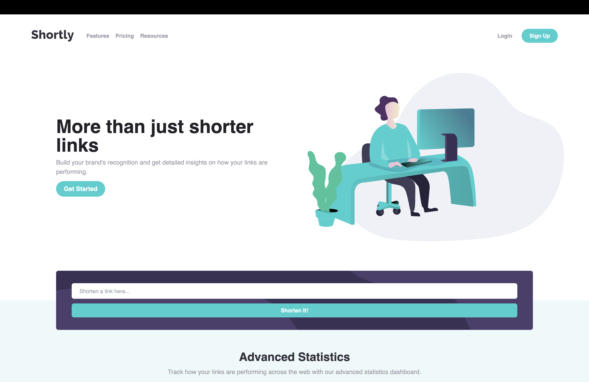

# URL Shortening

Welcome to my URL shortening project! This app allows you to shorten long URLs using the [Shrtcode API](https://shrtco.de/). Check out the live site at [url-facundo.vercel.app/](https://url-facundo.vercel.app/).

## Screenshots

Take a look at the app in action:

## Tech Stack

The project was built using React, Vite.js, and Tailwind CSS. Vercel was used for deployment.

## Optimizations

[ ] Fix error handling for no input

## Acknowledgements

A big thank you to the team at Shrtcode for providing the API used in this project. Additional thanks to the [Tailwind CSS documentation](https://tailwindcss.com/docs/installation) for their helpful resources.

## Author

This project was created by Facundo Perez Montalvo. Visit my portfolio at [facuperezm.com](https://facuperezm.com/) to learn more about me and my work.

 

I hope you enjoy using this app as much as I enjoyed creating it!
